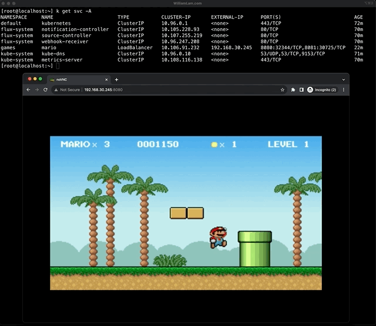
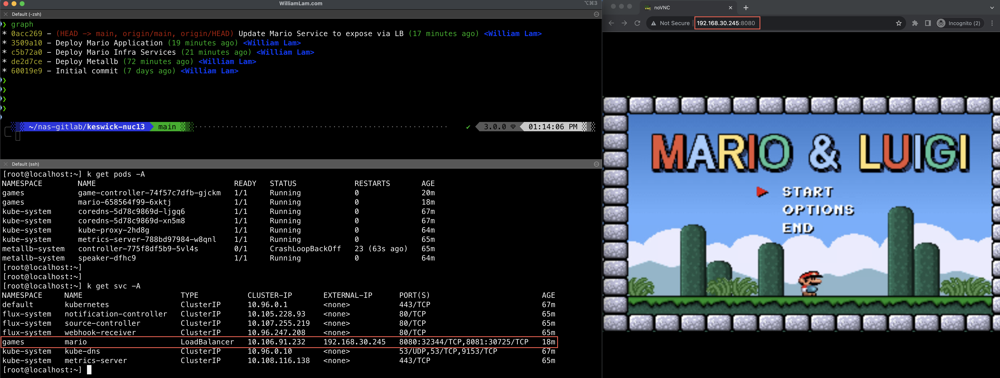

# Mario Demo for Project Keswick

This demo is based off of the following [blog post](https://williamlam.com/2021/02/retro-dos-games-on-kubernetes.html) which showcases a retro DOS game engine using [DOSBox](https://www.dosbox.com/), but delivered as a Kubernetes custom controller.



**Pre-req:**
* Download the [Mario DOS Game](https://dosgames.com/game/mario-and-luigi/) and host the _mario.zip_ on an HTTP(s) server that the Keswick host will have connectivity to download

**Deployment:**

> Note: Order of deployment commit is crucial to ensure that expected resources have been realized by the Kesick service

Step 1 - Edit the Metallb manifest and update the `addresses` IP Address range that you will be using for the load balancer.

Step 2 - Add [metallb.yaml](metallb.yaml) to your Keswick repo, which will deploy the Metallb load balanccer within your Keswick host

Step 3 - Add [mario-infra.yaml](mario-infra.yaml) to your Keswick repo, which will deploy the infrastructure required before you can deploy the Mario game

Step 4 - Edit [mario-app.yaml](mario-app.yaml) manifest and update the `zipURL` to your webserver that is hosting the _mario.zip_ file.

Step 5 - Add [mario-app.yaml](mario-app.yaml) to your Keswick repo, which will deploy the Mario game

Step 6 - Add [mario-service.yaml](mario-service.yaml) to your Keswick repo, which will update the Mario Kubernetes Service to expose it via LoadBalancer rather than requiring port forwarding

Step 7 - SSH to the Kesick host and run the following alias command, so we can inspect the Mario deployment:

```console
alias k="/bin/crx-cli exec --env 'KUBECONFIG=/mnt/volumes/volumes/kubernetes.io~empty-dir/etc-k8s/admin.conf' $(/bin/crx-cli list | grep infravisor-pod | awk '{print $1}') /infravisor/rootfs/keswick-control-plane/usr/bin/kubectl"
```

Step 8 - Run the following command to retrieve the service load balancer address that has been assigned to the Mario game:

```console
k get svc -A
```

In the example/screenshot below, the load balancer address is `192.168.30.245` and you can now open a browser to _http://192.168.30.245:8080_ to play the Mario game!

